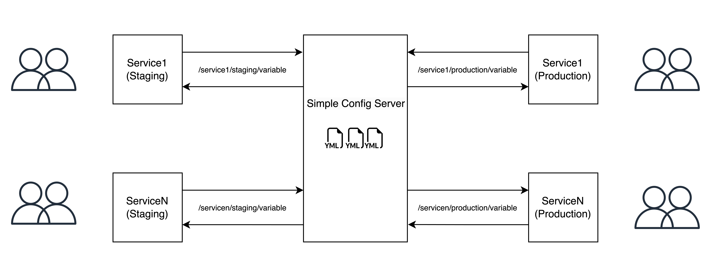

# Simple-Config-Server

A lightweight configuration management service that loads YAML-based configurations from a structured directory and exposes them via an HTTP API. It also includes authentication, IP filtering, and rate limiting.

### Use Cases

- Centralized configuration management for microservices.
- Securely store and retrieve configurations for different environments (e.g., development, staging, production).
- Fetch configurations from a remote server using a simple API.

### Illustration



### Project Structure

```
Simple-Config-Server
 │
 │── /configurations            # Stores project-specific configuration files
 │   ├── /sample
 │   │   ├── development.yml    # Example configuration file
 │   ├── Readme.md              # Documentation for adding configurations
 │
 │── /internal                  # Internal modules for core functionality
 │   ├── /auth                  # JWT-based authentication
 │   │   ├── jwt.go
 │   │
 │   ├── /config                # Configuration loader & file watcher
 │   │   ├── config.go
 │   │   ├── watcher.go
 │   │
 │   ├── /handler               # API handlers for retrieving configurations
 │   │   ├── handler.go
 │   │
 │   ├── /ipfilter              # IP whitelisting for security
 │   │   ├── filter.go
 │   │   ├── watcher.go
 │   │
 │   ├── /logger                # Logging utility
 │   │   ├── logger.go
 │   │
 │   ├── /rate_limiter          # Rate limiting middleware
 │       ├── limiter.go
 │
 │── /examples                  # Examples of API usage and setup
 │   ├── golang-client.go      # Example client in Go
 |   ├── python-client.py      # Example client in Python
 │
 │── .gitignore                 # Git ignored files
 │── allowed_ips.txt            # List of allowed IPs for access control
 │── allowed_ips.txt.example    # Example IP allowlist
 │── application.log            # Log file
 │── go.mod                     # Go module dependencies
 │── go.sum                     # Go module checksum file
 │── main.go                    # Entry point of the application
 │── LICENSE                    # License file
 │── README.md                  # Documentation
```

### Configuration Files

Please refer to the [configurations](configurations/Readme.md) documentation for adding configuration files.

### Usage

1. Clone the repository:
2. Add configuration files to the `configurations` directory.
3. Build the application:
    ```bash
    go build -o bin/simple-config-server main.go
    ```
4. Load the environment variables:
    ```bash
    export PORT=8080
    export JWT_SECRET=secret
    ```
5. Run the application:
    ```bash
    ./bin/simple-config-server
    ```
6. Access the API:
    ```bash
    curl -H "Authorization: Bearer <your_token>" -X GET http://127.0.0.1:8080/<project>/<environment>/<config>
    ```

Or using the Makefile:

```bash
make build
make run
```

### Build Client to Fetch Configurations

Please refer to the example client code in the [examples/client](examples/client) directory.

### Planned Features 🚀

- [ ] Support additional configuration formats (e.g., JSON, TOML) for greater flexibility.
- [ ] Enable configuration push to allow updates directly from clients.
- [ ] Introduce versioning to track and manage configuration changes.
- [ ] Implement encryption & decryption to enhance configuration security.


> Note: The configuration file should not contain any sensitive information such as passwords, API keys, etc. Sensitive information should be stored in a secure location and accessed using environment variables. This project is intended for use with non-sensitive configuration settings only.